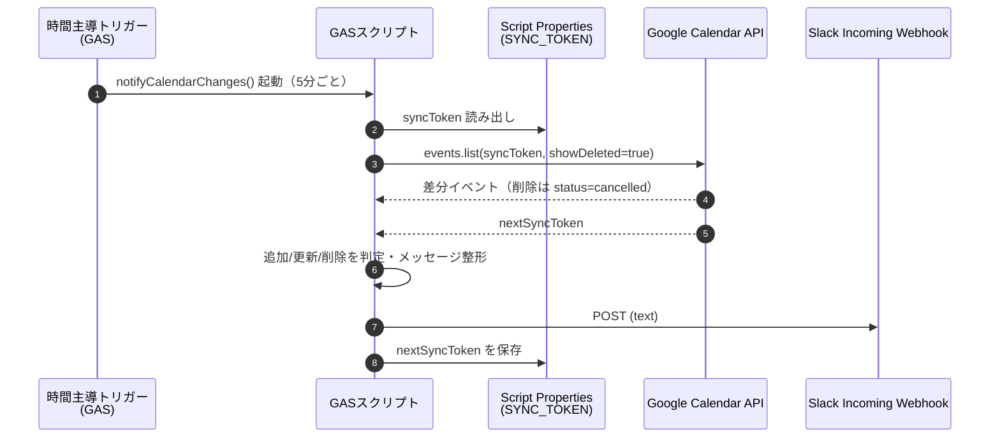

# 設計書: Googleカレンダー変更のSlack通知

## 1. 背景

- 以前は Slack の「Google Calendar for Team Events」アプリで、共有カレンダーの変更をチャンネルに通知できていたが、同アプリは廃止された
- 現行の公式「Google Calendar」Slack アプリは個人向けDM通知（リマインダー・招待応答・予定詳細変更の通知）が中心で、チャンネルへの変更フィードとしては機能しない

## 2. 目的

指定した Google カレンダー上の予定の **追加・更新・削除** を検知し、指定した Slack チャンネルに自動通知する。

## 3. 要件

### 3.1 機能要件

| ID | 要件 |
|---|---|
| F1 | 予定の追加を検知してSlackチャンネルに通知する |
| F2 | 予定の更新（日時・タイトル等の変更）を検知して通知する |
| F3 | 予定の削除（キャンセル）を検知して通知する |
| F4 | 通知先チャンネルを変更可能にする |

### 3.2 非機能要件

| ID | 要件 |
|---|---|
| N1 | 個人のGoogleアカウント・PCで運用を完結できる（外部SaaSに依存しない） |
| N2 | 無料枠内で運用できる |
| N3 | Webhook URL等のシークレットをリポジトリにコミットしない |
| N4 | 通知遅延はポーリング間隔（5〜15分）まで許容する |
| N5 | 取りこぼしが発生した場合も自動復旧できる |

## 4. 方式比較

| 方式 | 検知できる変更 | 速報性 | コスト | 運用 | 結論 |
|---|---|---|---|---|---|
| **GAS + Incoming Webhook** | 追加・更新・削除 | 5〜15分ポーリング | 無料 | Googleアカウント内で完結 | **採用** |
| Zapier / Make | 追加・更新・削除 | 1〜15分 | 量次第で有料 | 外部SaaS依存 | 不採用 |
| 公式 Google Calendar アプリ | 個人DM中心 | リアルタイム | 無料 | 設定のみ | 要件不適合 |
| Calendar API events.watch + 自前サーバ | 追加・更新・削除 | ほぼリアルタイム | サーバ実費 | HTTPS公開・ドメイン検証が必要 | 将来拡張候補 |

## 5. アーキテクチャ

- **GAS**: スクリプト本体。時間主導トリガーで定期実行
- **Script Properties**: 差分同期用 `syncToken` を永続化
- **Calendar API（Advanced Service）**: `Calendar.Events.list` で差分取得
- **Slack Incoming Webhook**: チャンネルへの投稿口

## 6. コンポーネント設計

| 関数 | 責務 |
|---|---|
| `openStore_()` | スクリプト プロパティの読み書き口。読み取りは1実行につき1回にまとめ、操作は再試行付きで行う |
| `withStorageRetry_()` | スクリプト プロパティの操作を指数バックオフ付きで再試行する |
| `getConfig_(store)` | Script Properties から設定値を読み出す。`CALENDAR_ID` はカンマ区切りで複数受け付ける |
| `initialize()` | 初回のみ手動実行。全カレンダーをフル同期して `syncToken` と指紋を保存（通知は出さない） |
| `primeFingerprints()` | 手動実行。`syncToken` を進めず、いまある予定の指紋だけを記録する |
| `primeCalendar_()` | フル同期の結果から指紋を記録する。指定のイベントIDは記録しない |
| `pendingChangedIds_()` | 保存済み `syncToken` から、まだ通知していない差分のイベントIDを集める |
| `idsOf_(events)` | 差分に含まれるイベントIDを集める |
| `createBaseline_()` | フル同期して `syncToken` を保存し、得た予定の指紋も記録する |
| `notifyCalendarChanges()` | 定期実行。スクリプトロックを取り、カレンダーごとに差分処理する |
| `notifyOneCalendar_()` | 1カレンダー分の差分取得→判定→Slack投稿→記録。戻り値は投稿失敗件数 |
| `commitSeen_()` | 投稿し終えた差分を記録する（`syncToken` → 指紋の順）|
| `migrateLegacySyncToken_()` | 単一カレンダー時代の `SYNC_TOKEN` を `SYNC_TOKEN:<カレンダーID>` へ移す |
| `fullSync_(calendarId)` | 現時点を基点にフル同期して `{ items, syncToken }` を返す。`items` は繰り返し予定が先 |
| `isRecurringRelated_(ev)` | シリーズ本体か、その1回かを判定 |
| `isSyncTokenExpired_(e)` | 例外が `syncToken` 失効（410）由来かを判定 |
| `formatMessage_(calendarId, ev)` | イベント状態から通知種別（追加/更新/削除）と本文を整形 |
| `resolveTitle_(calendarId, ev)` | タイトルを解決。削除イベントで `summary` が無ければ親の繰り返し予定から補う |
| `formatWhen_(ev)` | 日時表示を整形。繰り返しシリーズか個別occurrenceかを注記する |
| `isPastOccurrence_(ev)` | 繰り返し予定の「過ぎた回」かを判定。通知対象から落とすために使う |
| `isUnchangedResend_(ev, fingerprints)` | 前回見たときと中身が変わっていないイベントかを判定。通知対象から落とすために使う |
| `isSeriesEchoOfOccurrence_()` | 回の変更に伴って返ってきただけのシリーズ本体かを判定。通知対象から落とすために使う |
| `parentIdsOf_(events)` | 差分に含まれる「繰り返しのうち1回」の親IDを集める |
| `eventFingerprint_(ev)` | イベントの中身の指紋を返す |
| `semanticFingerprint_(ev)` | 管理情報（`BOOKKEEPING_FIELDS`）を除いた指紋を返す |
| `canonicalize_(value, ignoredFields)` | 指紋を取るための正規化。キーをソートし、無視するフィールドを落とす |
| `digest_(text)` | MD5の先頭8バイトを16進で返す |
| `readSeenEvents_()` / `writeSeenEvents_()` / `toFingerprintMaps_()` | `SEEN_EVENTS:<カレンダーID>` の読み書きと引き当て |
| `toCalendarDate_(value)` | スクリプトのタイムゾーンで `yyyy-MM-dd` を返す |
| `postToSlack_(webhookUrl, text)` | Incoming Webhook へ POST。429と5xxは再試行し、成否を返す |

### 繰り返し予定の扱い（`singleEvents: false`）

`events.list` は `singleEvents: false` で呼ぶ。`true` にすると終了日なしの繰り返し予定が将来方向の全インスタンスへ展開され、シリーズを1回変更しただけで数百件の差分が返る（2026-08-08 に実測: 単一シリーズの変更で 2034〜2087年 の全インスタンスが差分に乗り、数百件のSlack投稿が発生した）。

`false` にすることで:

- 繰り返し予定の変更はシリーズ1件の差分になる
- `ev.start` は初回occurrenceの日時になるため、`ev.recurrence` があれば「〜から（繰り返し予定）」と注記する
- 個別occurrenceの変更・削除は `recurringEventId` と `originalStartTime` を持つ別アイテムとして返るため、その回の日時を表示する

なお `syncToken` は取得時のクエリパラメータと紐づくため、`singleEvents` を変更したら `initialize()` をやり直す必要がある。

### 過ぎた回の除外

繰り返しシリーズを1回編集すると、そのシリーズに紐づく**過去の例外インスタンス**（過去に個別変更・削除した回）まで差分として返る。`initialize()` の `timeMin` はフル同期の範囲を絞るだけで、例外インスタンスには効かない（2026-08-08 に実測: 常用の繰り返し予定を数件編集しただけで、数か月前の回の削除通知が48件発生した）。

そこで `isPastOccurrence_()` で以下を通知対象から落とす。

- `recurringEventId` を持つ（＝シリーズ本体ではなく個別の回）
- かつ `originalStartTime`（無ければ `start`）の**日付**が今日より前

判定を日付単位にしているのは、今日の回を残すため。「今夜のごはんを1件だけ削除」は通知される。シリーズ本体は開始日が過去でも除外しない — 「その繰り返し予定を変更した」こと自体は知りたいため。

除外は通知件数の上限判定より前に行う。過去回だけで上限を超えてサーキットブレーカーが誤作動するのを避ける。

### 巻き添えの再送の除外

繰り返し予定を1回分だけ削除しても、差分にはその回だけが乗るとは限らない。シリーズ本体や、以前に個別変更・削除した**未来の**回まで一緒に返ってくる（2026-08-14 に実測: 9/2 の1回を削除しただけで、シリーズ本体2件・別の回の削除2件を巻き添えに計5件のSlack通知が飛んだ）。「過ぎた回の除外」は日付が今日より前の回しか落とさないので、未来の回の巻き添えはそのまま通知になっていた。

そこで、差分で見たイベントの**指紋**（中身のハッシュ）を `SEEN_EVENTS:<カレンダーID>` に残しておき、`isUnchangedResend_()` で「前回見たときと指紋が同じ」＝中身が1バイトも変わっていないイベントを落とす。

| 判断 | 理由 |
|---|---|
| `updated` の新しさでは判定しない | `updated` は main event data の最終更新時刻で、[公式リファレンス](https://developers.google.com/workspace/calendar/api/v3/reference/events)いわく**リマインダーを変更しても進まない**。「`updated` が古い」は「変わっていない」の証明にならず、リマインダーだけを変えた正当な変更を握りつぶす |
| 指紋が無い初見のイベントは落とさない | 変わっていないと確認できていないため。巻き添えの回も一度は通知され、そこで指紋が残るので次の巻き添えからは黙る。最悪でも従来どおりの通知量に戻るだけで、通知が消えることはない |
| 無視するフィールドは列挙し、それ以外は未知のものも含めて指紋に入れる | 逆（対象を列挙する）にすると、リストから漏れたフィールドの変更を黙って捨ててしまう。無視するのは `etag`・`kind`・`htmlLink` の3つだけ（中身が同じでも変わりうる／通知に関係しない） |
| 指紋は保存量に上限を設け、古いものから捨てる | Script Properties は1プロパティ 9KB。溢れた分は「初見扱い」に戻るだけで、通知が消える方向には倒れない |
| 記録するのは通知したものだけでなく、差分で見たすべて | 「過ぎた回」として落とした分こそ再送の常連なので、記録しないと毎回すり抜ける |

この方式は判定に時刻を使わないため、トリガーの間隔・実行の遅れ・時計のずれのいずれにも影響されない。繰り返し予定の回を続けて何件も消すような、同じイベントが短時間に何度も差分へ乗る操作でも二重通知にならない。

なお、シリーズ本体そのものを変更した場合は本体の指紋が変わるので、従来どおり「✏️ 予定が更新されました」が1件飛ぶ。

#### 指紋の下敷きを先に作る

指紋が無いイベントは落とせないため、何もしなければ**シリーズごとに1回は巻き添えの通知が出てから静かになる**（2026-08-17 に実測: サウナの 8/17 を消したところ、そのシリーズは初見だったためシリーズ本体と過去に消した 11/23 の分も通知された）。監視対象に繰り返し予定がいくつもあると、この空振りが順番に出てくる。

そこで、フル同期のついでに指紋を記録する。記録済みかどうかは `FINGERPRINTS_PRIMED_AT:<カレンダーID>` で持つ。

- **定期実行が、下敷きの無いカレンダーを見つけたら1回だけ自分で作る。** マーカーが無ければ差分の取得より先にフル同期し、その実行で通知する差分を除いて記録する。デプロイしただけで次のトリガーが下敷きを作るので、手作業は要らない
- `initialize()`・新規カレンダーの基準点作成・`syncToken` 失効時の再初期化（すべて `createBaseline_()`）は、`fullSync_()` が返した予定の指紋をそのまま保存する。基準点を取り直した直後に巻き添えが噴き出さない
- `primeFingerprints()` は手動で下敷きを作り直す口。トリガーを待たずに埋めたいときや、`SEEN_EVENTS` を消してやり直したいときに使う

自動作成でフル同期を**差分取得より先**に行うのは `primeFingerprints()` と同じ理由。後にすると、その間に入った変更が「変更後」の姿で記録され、次の実行で通知が消える。あわせて、その実行で通知する差分（`idsOf_(changed)`）も記録対象から外す。

`primeFingerprints()` で気をつけるのは、**まだ通知していない差分を指紋で先回りして消さないこと**。`syncToken` を進めないだけでは足りない。前回の定期実行のあとに変更された予定は、フル同期では「変更後」の姿で返ってくる。その指紋を記録してしまうと、次の定期実行が同じ差分を受け取ったときに「前回見たときと同じ」と判定し、通知すべき変更が消える。

そこで次の順序で処理する。

1. `fullSync_()` で現在の一覧を取る
2. 保存済み `syncToken` から未取得の差分を全ページ取る（`pendingChangedIds_()`。`syncToken` は更新しない）
3. 差分に居たイベントを 1 の一覧から外す
4. 残りだけを `SEEN_EVENTS` に記録する

1 のあとに 2 を取るのが要点。その間に入った変更も差分側に現れるので、記録対象から外れる。

| 判断 | 理由 |
|---|---|
| 定期実行と同じスクリプトロックを取る | 同時に走ると `SEEN_EVENTS` の更新を互いに上書きする。`tryLock(0)` で取れなければ `primeFingerprints()` は例外で中止し、逆に手動実行中のトリガーは従来どおりスキップする |
| 差分の取得に失敗したら指紋を書かずにエラーにする | どのイベントが未通知か分からないまま記録すると、通知が消える側に倒れる。`syncToken` 失効も同様に扱う（次の定期実行が基準点を作り直し、そこで指紋も記録される） |
| `syncToken` は進めない | 未取得の差分を通知するのは定期実行の仕事。手動実行が通知を横取りしない |

この順序と排他のおかげで、何度実行しても通知が消えたり重複したりしない。

保存の枠（`SEEN_EVENTS_MAX_ENTRIES` / `SEEN_EVENTS_MAX_BYTES`）に収まらないときは、`fullSync_()` が繰り返し予定（シリーズ本体とその回）を先に並べて渡す。再送の常連はそちらなので、単発の予定より優先して残す。

### 回の変更に伴うシリーズ本体の除外

繰り返し予定の1回を削除・変更すると、その回だけでなく**シリーズ本体も差分に乗る**。本体側は `updated` や `sequence` といった管理情報が動くだけなので中身の指紋は変わり、上の「巻き添えの再送の除外」では落ちない（2026-08-15 に実測: 8/19 の回を削除したところ、回の削除通知とシリーズ本体の更新通知が対で飛んだ）。

そこで `isSeriesEchoOfOccurrence_()` で、次のすべてを満たすシリーズ本体を落とす。

- 同じ差分に、その本体に属する回が居て、**その回を今回通知する**
- **管理情報を除いた指紋**（`semanticFingerprint_()`）が前回と同じ＝本体そのものは何も変わっていない

| 判断 | 理由 |
|---|---|
| 「通知する回が居るとき」に限る | 回を落とした（過去回・再送）結果として本体だけが残る場合は、本体の通知が唯一の知らせになる。黙らせると変更が丸ごと消える |
| 通知の**文面**では判定しない | 文面に出るのはタイトル・日時・種別だけ。文面で比べると、リマインダー・繰り返しルール・終了日時・場所・説明・参加者といった「文面に出ないシリーズの変更」が回の操作と同じ差分に来たときに握りつぶす。とくに「リマインダーだけの変更も通知する」保証（上節）が壊れる |
| 除外するのは `updated` と `sequence` だけ | 回を操作したときに本体側で動くのはこの2つ。それ以外は未知のフィールドも含めて指紋に残し、本体そのものの変更を見落とさない |
| 除外するのは**イベント直下**のみ | `extendedProperties.private/shared` には任意のキーを置けるため、同名のキーがあると深い階層まで落としたときに利用者の値の変更を見落とす。浅いコピーから消してから正規化する |
| 管理情報を除いた指紋はシリーズ本体にだけ持つ | 使うのは本体の判定だけ。全イベントに持たせると `SEEN_EVENTS` の枠を無駄に食う |
| 3要素目が無いキャッシュでは抑止しない | 旧形式（`[イベントID, 中身の指紋]`）のままなら、変わっていないと確認できていない。従来どおり通知する安全側に倒す |

### 通知件数の上限

1カレンダー・1実行あたりに個別通知する件数を `MAX_NOTIFICATIONS_PER_RUN`（既定 20件）に制限する。超えた場合は件数のみを1件通知して打ち切る。`singleEvents: false` で大量発生の主因は取り除いているが、想定外の一括変更に対するサーキットブレーカーとして残す。抑止した差分も投稿後に記録するため、次回以降に再度通知されることはない。

上限をカレンダー単位にしているのは、あるカレンダーの暴走が他のカレンダーの正常な通知を巻き添えにしないため。監視対象がN件なら最悪 N件 の警告が出る。

### テスト

`test/` に `node --test` の回帰テストを置く（`npm run check` から実行され、CIで走る）。GASのグローバル（`PropertiesService`・`Calendar`・`UrlFetchApp`・`Utilities` など）を差し替えて `src/Code.js` をそのまま評価する薄いハーネス（`test/gas-harness.mjs`）を通し、カレンダーの応答を与えてSlackに何が投稿されるかを確かめる。スクリプト プロパティは実行間で持ち回せるので、「1回目で指紋を残し、2回目の再送で黙る」といった複数回にまたがる挙動も書ける。

### スクリプト プロパティの一時障害

`PropertiesService` は Google 側の都合で `We're sorry, a server error occurred while reading from storage. Error code INTERNAL.` を返すことがある（2026-08-19 に定期実行が約25分のあいだ5回落ちた）。コード側では避けられないので、踏んでも取りこぼさない・気づかず終わらないようにする。

| 手当 | 理由 |
|---|---|
| 読み取りは `getProperties()` で1実行1回にまとめる | 1カレンダーあたり9回叩いていた。呼び出すたびに障害を踏む機会が増えるので、写しを1つ持って使い回す。書き込みは写しと実体の両方へ即座に通す |
| 読み書きを最大 `STORAGE_ATTEMPTS`（4回）まで指数バックオフ（500ms → 1s → 2s）で再試行する | この障害は数百ミリ秒から数秒で復旧することが多い。読み取り・書き込み・削除はいずれも冪等なので、再試行そのものは安全に行える |
| 権限不足・値のサイズ超過・呼び出し上限（`PERMANENT_STORAGE_ERROR`）だけは再試行せず即座に諦める | 待っても直らない。設定不備を再試行のログで埋もれさせない |
| 使い切ったら例外にする | 握りつぶすと静かに通知が止まる。GAS の失敗通知メールで気づけるようにする |
| 記録（`syncToken`・指紋）は Slack へ投稿し終えてから行う | 逆順にすると、記録と投稿のあいだで落ちたときに「差分は消費済み・通知は未送信」となって取りこぼす。投稿を先にしておけば `syncToken` が進まないので、次の実行が同じ差分をもう一度通知できる（最悪でも重複＝安全側） |
| 記録は `syncToken` → 指紋 の順で書く | 指紋だけ書けて `syncToken` を書けないと、次の実行が同じ差分を「前回見たときと同じ」と判定して通知を消す。逆なら指紋が古いまま残るだけで、1回多く通知されて済む |

再試行の判定を「一時障害を挙げて再試行する」ではなく「恒久エラーを挙げて即座に諦める」向きにしているのは、見落としたときの転び方が逆だから。一時障害の文言（`INTERNAL` など）を挙げ漏らすと再試行が効かず、この仕組みが防ごうとしている取りこぼしがそのまま残る。逆に恒久エラーを挙げ漏らしても、数秒よけいに待って同じように失敗するだけで済む。GASの例外メッセージは実行者のロケールで変わりうるので、この差は小さくない。

写しを持つことで実体とずれるのは、実行中に別の実行がプロパティを書き換えたときだけ。定期実行と `primeFingerprints()` はロックで排他しているので起こらない。

### 多重実行の排他

`notifyCalendarChanges()` は `LockService.getScriptLock()` を `tryLock(0)`（待たない）で取得する。前回の実行が続いている間に次のトリガーが起動した場合は、待たずにスキップしてログに残す。差分は次回の実行で拾えるため取りこぼしにはならない。

### 複数カレンダー

`CALENDAR_ID` にカンマ区切りで複数指定できる。`syncToken` はカレンダーごとに `SYNC_TOKEN:<カレンダーID>` へ保存する。監視対象が2件以上のときだけ、通知本文の末尾に `カレンダー: <名前>` を添える（名前は `events.list` レスポンスの `summary` から取得するので追加のAPI呼び出しは不要）。

単一カレンダー時代の `SYNC_TOKEN` キーは `migrateLegacySyncToken_()` が初回実行時に移行する。

### 追加/更新/削除の判定ロジック

- `ev.status === 'cancelled'` → **削除**
- `updated - created < 60秒` → **追加**
- 上記以外 → **更新**

### 設定値

すべて Script Properties に保存し、コードには一切書かない（tasks.md T12 を初期実装に前倒し）。

| キー | 内容 | 設定者 |
|---|---|---|
| `CALENDAR_ID` | 監視対象カレンダーのID（カレンダー設定 →「カレンダーの統合」で確認）。カンマ区切りで複数指定できる | 手動 |
| `SLACK_WEBHOOK_URL` | Slack Incoming Webhook の URL | 手動 |
| `SYNC_TOKEN:<カレンダーID>` | 差分同期用トークン。カレンダーごとに1件 | `initialize()` が自動保存 |
| `SEEN_EVENTS:<カレンダーID>` | 直近に見たイベントの指紋 `[[イベントID, 中身の指紋, 管理情報を除いた指紋?], ...]`（3つめはシリーズ本体のみ）。巻き添えの再送を落とすのに使うキャッシュ | 定期実行が自動保存 |
| `FINGERPRINTS_PRIMED_AT:<カレンダーID>` | 指紋の下敷きを作った時刻。1カレンダーにつき1回だけ作るための目印 | 定期実行が自動保存 |

## 7. 状態管理・障害対応

- `syncToken` は Script Properties の `SYNC_TOKEN` キーに保存
- `syncToken` 失効（410 Gone）時は例外を捕捉して `initialize()` で再初期化（N5）
  - 再初期化時点までの差分は取りこぼす可能性があるが、通知用途として許容
  - 410 以外の例外（一時的な 5xx・クォータ超過など）では **再初期化しない**。`syncToken` を温存したまま再スローし、次回トリガーで同じ差分を取り直す
- スクリプト プロパティの一時障害（`Error code INTERNAL`）は最大4回まで指数バックオフで再試行する。権限不足など待っても直らないエラーは再試行しない。使い切ったら例外にして失敗通知メールに載せる（詳細は「スクリプト プロパティの一時障害」）
- Slack 投稿は 429 と 5xx（および fetch 自体の失敗）を最大3回まで再試行する。4xx は再送しても直らないため即座に諦める
- `UrlFetchApp.fetch` は `followRedirects: false` で呼ぶ。無効な Webhook URL に対して Slack は 302 を返すため、既定（リダイレクトを追う）のままだと最終的な着地先のステータス次第で「URLが壊れている」ことを成功と誤認しうる
- それでも失敗した Slack 投稿は取りこぼしになる（投稿を試みた差分は投稿後に記録され、次の実行には出てこない）。1回の実行で1件でも失敗したら例外を投げ、GAS の失敗通知メールで気づけるようにする
- OAuth承認切れやトリガー失敗はGASの失敗通知メールで検知

## 8. セキュリティ

- リポジトリは public。シークレット（Webhook URL）と個人情報（カレンダーID）は、コード・ドキュメント・コミット履歴のいずれにも書かない
- 設定値はすべて GAS の Script Properties に置く（§6 設定値）。`.clasp.json`（スクリプトID）と `.clasprc.json`（clasp認証情報）は `.gitignore` 済み

## 9. 将来拡張

- Block Kit によるリッチな通知・担当者メンション
- `events.watch` + Cloud Run / Cloud Functions によるリアルタイム化
- 週次ダイジェスト通知

※ 複数カレンダー対応（カレンダーIDごとに SYNC_TOKEN を管理）は §6 で実装済み。
