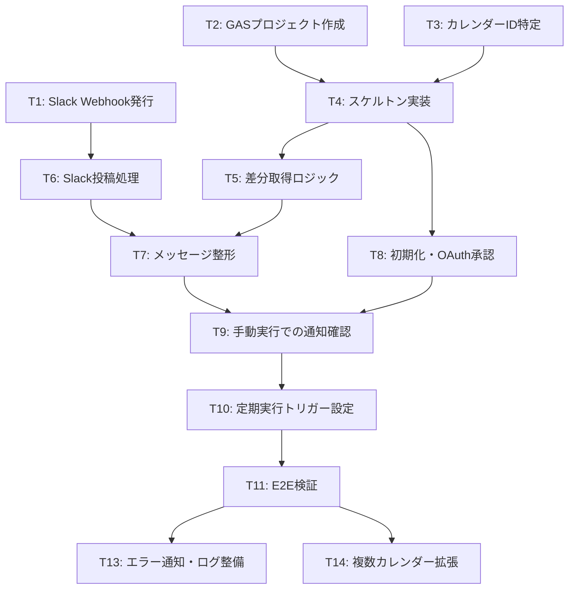

# タスク分解

設計書（docs/design.md）にもとづき、依存関係を考慮してタスク化したもの。

## 依存関係図

## 進捗

- Phase 1（T4〜T7）と T12 は実装済み。
- Phase 0（T1〜T3）と Phase 2（T8〜T11）は 2026-08-07〜08 に実施済み。追加・更新・削除の3種別とも Slack への通知を実測で確認した。
- T11 の過程で繰り返し予定による通知の大量発生を検出し、`singleEvents: false` 化と1実行あたりの通知件数上限で対処した（docs/design.md §6 参照）。
- Phase 3（T12〜T14）も実施済み。全タスク完了。

## Phase 0: 準備（並行可能）

| ID | タスク | 依存 | 完了条件 |
|---|---|---|---|
| T1 | Slack App を作成し Incoming Webhook を有効化、通知先チャンネルを指定して Webhook URL を発行 | なし | Webhook URL を取得済み |
| T2 | GAS プロジェクトを作成し、`.clasp.json` を用意して `npm run push` でソースを配置（Advanced Service はマニフェストで宣言済み） | なし | エディタで `Calendar` が補完される |
| T3 | 監視対象カレンダーのIDを特定（カレンダー設定 →「カレンダーの統合」） | なし | カレンダーIDを控え済み |

## Phase 1: 実装（完了）

| ID | タスク | 依存 | 完了条件 | 状態 |
|---|---|---|---|---|
| T4 | スケルトン実装: `getConfig_()`（Script Properties 読み出し）、`initialize()`（syncToken初期取得） | T2, T3 | 文法エラーなく保存できる | 済 |
| T5 | 差分取得ロジック: `syncToken` による `events.list` ページング・410時のみ再初期化 | T4 | 差分0件でも正常終了する | 済 |
| T6 | Slack投稿処理: `postToSlack_()` | T1, T4 | テキストをWebhookにPOSTできる | 済 |
| T7 | メッセージ整形: 追加/更新/削除の判定と本文生成 | T5, T6 | 3種別のメッセージが生成される | 済 |
| T12 | 設定値（Webhook URL / カレンダーID）を Script Properties 化 | — | コードからシークレットが消える | 済（前倒し） |

## Phase 2: 検証

| ID | タスク | 依存 | 完了条件 |
|---|---|---|---|
| T8 | Script Properties に `CALENDAR_ID` / `SLACK_WEBHOOK_URL` を登録し、`initialize()` を手動実行して OAuth 承認を完了 | T1, T3, T4 | Script Properties に SYNC_TOKEN が保存される |
| T9 | テスト予定を追加 → `notifyCalendarChanges()` 手動実行で通知確認 | T7, T8 | Slackチャンネルに「追加」通知が届く |
| T10 | 時間主導トリガー（5分ごと）を `notifyCalendarChanges()` に設定 | T9 | トリガー一覧に登録される |
| T11 | E2E検証: 予定の追加・更新・削除がすべて通知される | T10 | 3操作とも5〜10分以内に通知される |

## Phase 3: 運用改善（任意・並行可能）

| ID | タスク | 依存 | 完了条件 | 状態 |
|---|---|---|---|---|
| T13 | エラー通知・ログ整備。①トリガー重複実行の排他（LockService）②Slack投稿のリトライと失敗の可視化 ③削除通知のタイトル欠落 | T11 | 失敗時に検知でき、①〜③が解消されている | 済 |
| T14 | 複数カレンダー対応 | T11 | 複数IDをループで監視できる | 済 |
